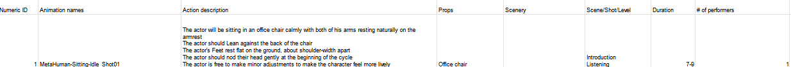
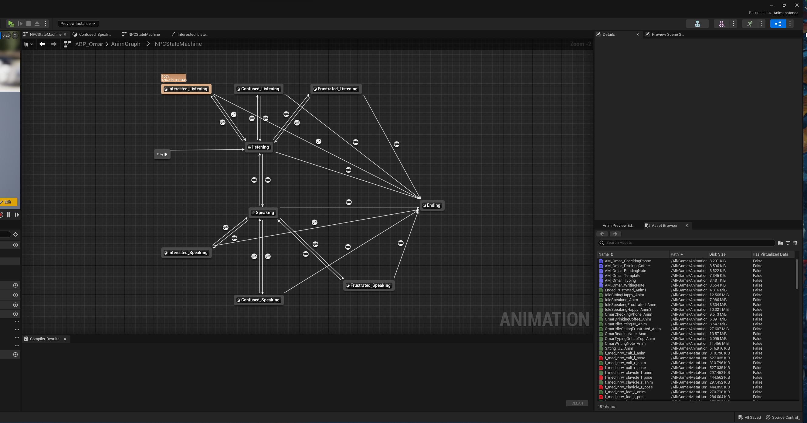
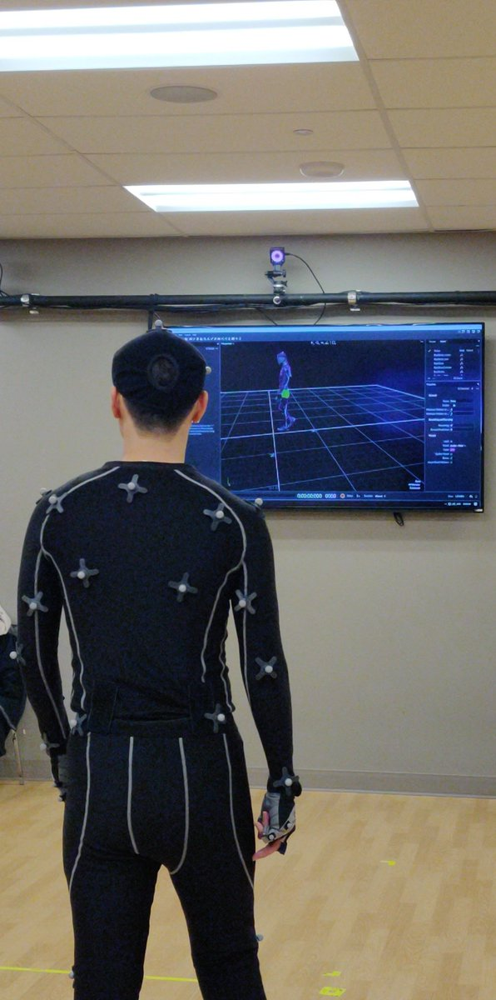
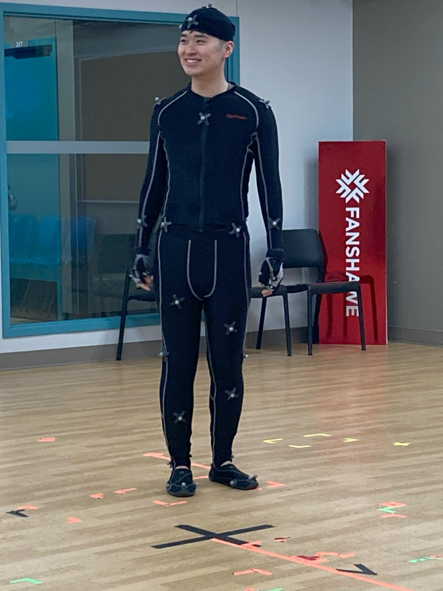
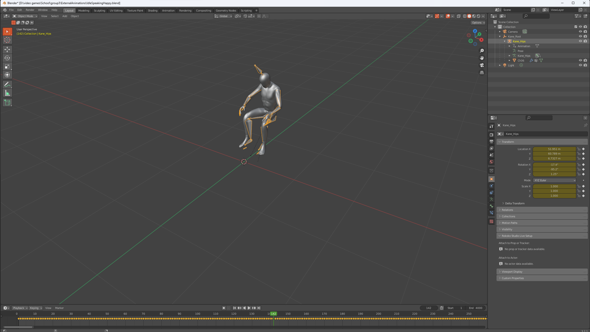
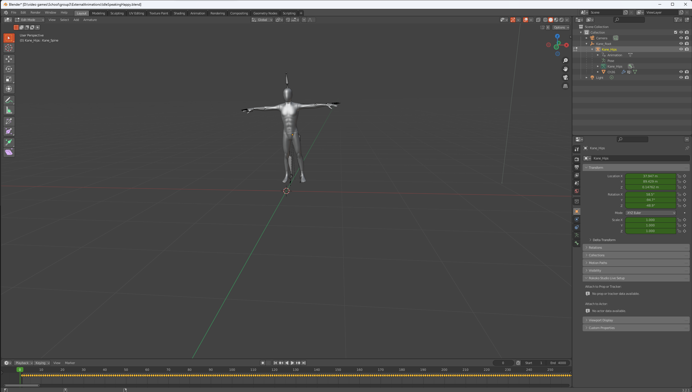
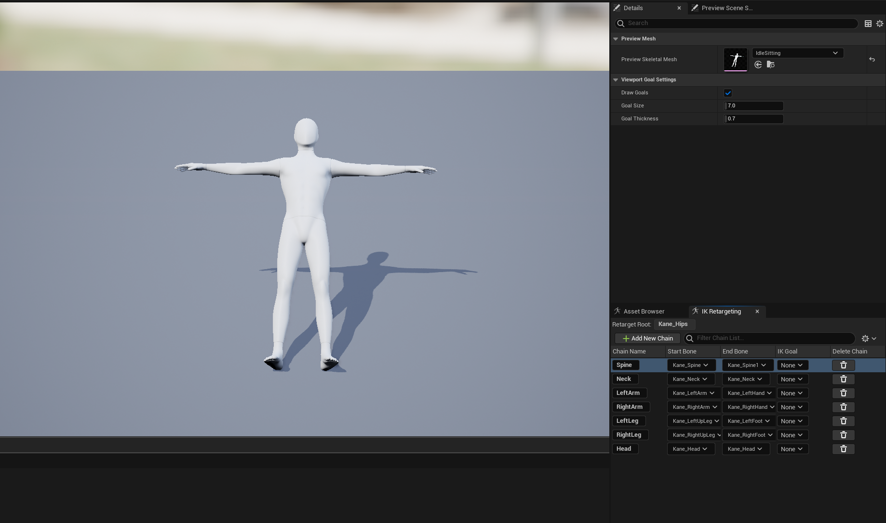
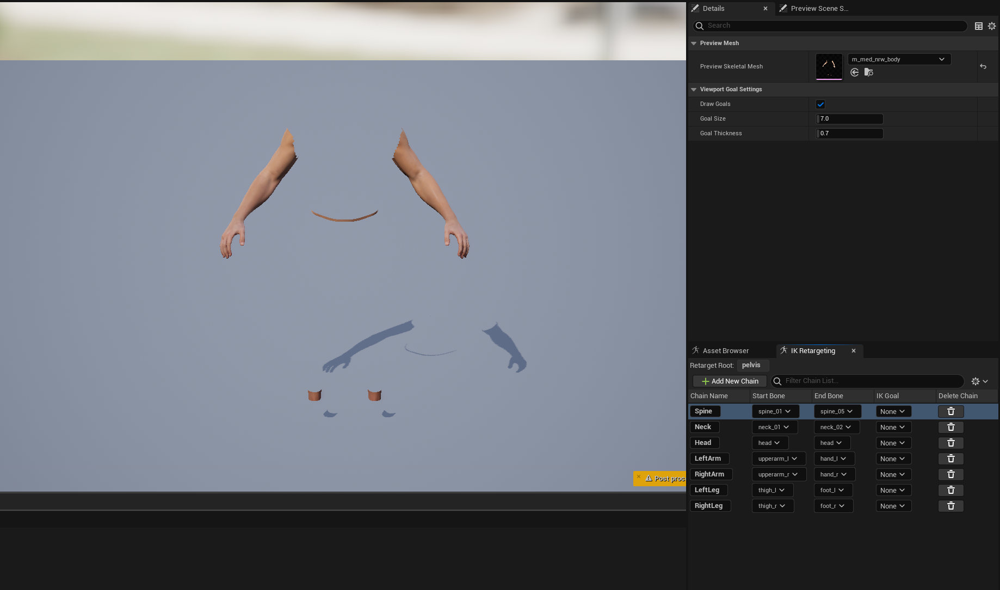
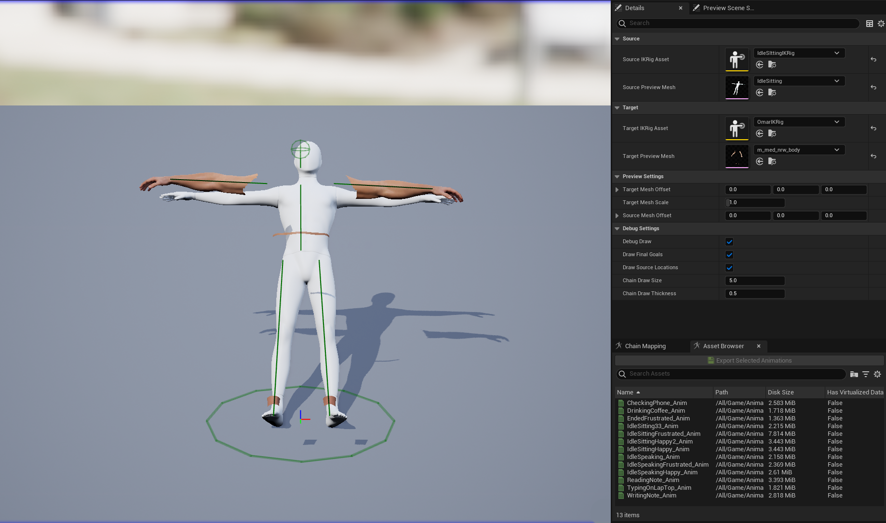
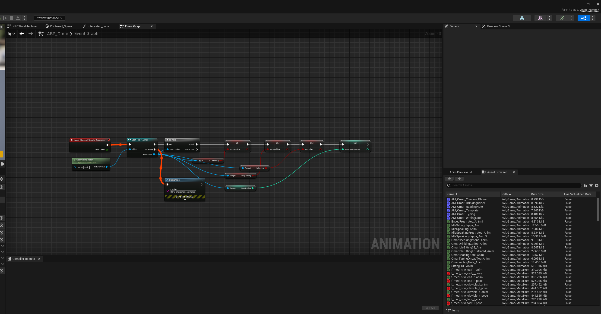

# Capture on the Virtual Stage: a Guide to Successful Motion Capture Production-final

### Introduction

Over the past year, I completed my minor in video game development at Western University. I was tasked with designing a VR mock interview game using Unreal Engine 5 for the university’s biology department. While working on the project, I collaborated with Fanshawe College to capture in-game character animations in their state-of-the-art motion capture studio. This article offers a glimpse into my journey, from the pre-production groundwork to the integration of animation into the final product. Throughout the article, I will point out common challenges, provide practical tips, and share problem-solving strategies I devised. Join me as we delve into the fascinating world of motion capture and its application in the video game industry. 

### Project Overview

The VR mock interview game project was a collaboration between Western University's Department of Computer Science and the Department of Biology. The project seeks to create a platform where students can experience, practice, and ultimately become confident with the interview process. During the game, the interviewer will ask the student a series of common interview questions and react according to the student's answer. The game can also utilize biosensors equipped on the HP concept VR headset to track students' cognitive load and heart rate in real-time to provide data for performance analysis after the interview.

The VR mock interview project was developed with only two developers - myself included. With double the responsibilities compared to a group of 4 working on a comparable project, we were required to pull more weight and multi-task. While my colleague was in charge of creating the metahuman character, designing the level landscape, the listening and responding system, and recording audio for the interview questions, I was in charge of animation, level design, integrating the biometric censors on the VR headset to the game, and managing and coordinating the project.

##### Metahuman 

Metahuman is a crucial component in our project's technology stack. Developed by Epic Games and natively integrated into the Unreal engine, metahuman is a high fidelity, cloud-streamed character creation framework to generate ultra-realistic, fully rigged, lifelike, digital humans. Metahuman is soon becoming the industry standard way to create characters for video games within as short as a few minutes and with endless opportunities. We have decided to use metahuman to provide the most realistic interview experience possible, making the character animation's quality even more important to create an immersive experience and bridge the uncanny valley.

### Pre-production preparations

The pre-production stage of a motion capture project is often overlooked. However, it plays a critical role in the project. Efficient communication, precise coordination, attention to detail and a deep understanding of the overall project set the foundation for success. 

##### Finalize the level design but to make sure to leave room for change

For the VR mock interview game, the level design needed to reflect the realistic and professional settings of the working space while maintaining the flexibility of adjustment based on the result of motion capture; some items need to be aligned precisely to enable further interactions between the animated character and in-game objects. In addition, finalizing the level design also helps me, the set builder, to visualize the physical interaction and spatial relationship between the character and the level, allowing me to re-construct the set quickly and precisely. In addition, knowing which part of the animation the player cannot see during gameplay is certainly an asset during production.

##### Create a comprehensive shot list

Apart from the basic project name, date and names of the participants, there are few other vital pieces information that should be included in the shot list

| Name:                | Description:                                                 |
| -------------------- | ------------------------------------------------------------ |
| Animation ID         | An index ID for each required animation sequence. Using IDs can easily help you to keep track of the number of animations needed in total and are especially useful for making shooting plans. |
| Animation Name       | This is the name the technician will use to save the file. Having all the shot names ready and listed can save you time and energy to create a meaningful name during filming. |
| Action description   | The actions description should provide context and detailed instructions to the actor on what to do for each clip. I prefer a bullet point style of action description, where the first few points describe the context and the potential use case of the animation clip; the rest is a step-by-step guide on what the actor needs to perform. |
| Props                | Props, perhaps, is a bit of a misleading term. It's supposed to be where you can describe the furniture and equipment needed for the clip. However, in reality, real-life furniture and equipment often block the view of the motion capture camera significantly and are often replaced with simple crates. Be prepared to re-create your set using a few boxes instead. This is when playing and walking around within your environment in VR comes in really handy. |
| Scene/Shot/Level     | Here allows us to categorize the shots and help you keep the animation file organized. In my project, I've categorized the shot using the state of the animation, i.e. if the animation is played when the interviewer is listening, talking, greeting, or ready to end the interview process. The grouping varies depends on the project |
| Duration             | Duration represents the expected length of the animation; It helps the actor to create a sense of timing for their actions. However, given the indignant size of the file, it is recommended to record as long as possible and even repeat the same action several times during the same shot. Even if some of the shots are sub-optimum, there are always back-ups. Usually a rough estimation of the duration will suffice |
| Number of performers | The number of performers determines how many sets of tracking suits and trackers you will need or if the actor needs assistance to perform certain actions to make them look more natural. I placed myself in front of the actor during several shots, interacting with him and helping him to act more naturally and less awkwardly. |

Here is a sample of the shot list I created for the shoot.

##### Rehearse with the actors 

As a result of budget constraints, we weren't able to afford a professional mocap actor. Thankfully, a friend of mine volunteered. In this case, it is even more important to rehearse with the actor before the shoot. Rehearsing with the actor is not limited to simply practicing the motion; It's also the opportunity for the actor to familiarize himself with the emotions and settings of the game and become aware of any technological limitations of the system.
One aspect we emphasized to our actor was to exaggerate the action and expression during motion capture. Video game animations often require movement amplification to convey emotions effectively to the player.
Finally, as a side note, the optimum height of the actor for the system we are working with (OptiTrack) is between 5ft 6 to 6 ft and should be average build; requirements for different systems and characters may vary. 

##### Set up the animation system in Unreal engine first and Practice re-targeting animation ahead of time

Preparation is always the key, and practice makes perfect. It's crucial to set up the IK rig for the metahuman and practice the re-target process with animation from external animation libraries (Mixamo, in my case) as much as possible before the shoot. This can be a lifesaver, especially when you have dozens of animations that must be processed and something goes wrong. At least you know that once the problem has been resolved, it will take you no time to process the animations. In addition, I also had the animation blueprint for the Interviewer character setup ahead of time and the animation transition logic implemented and tested before the shoot. This way, once the animation has been processed, it can be plugged directly into the animation blueprint and ready to be used. 

### Filming day

##### The role of the crew

Filming motion capture animations require the collaboration between multiple roles. Here is a brief summary of the responsibility of each position

###### The Director:

The director oversees the overall production process of the project. In particularly, as the director, I was responsible for creating and distributing the shot list, counting actors and technicians, and conduct meeting to finalize and rehearse all the actions. During the shoot, I also directed the actor and reviewed some of the footages to ensure the capture was going successfully

As the director, I developed a few default positions for the actor, described them in detail, and used them at the beginning and end of every shot. This way, the animations can be combined smoothly, and the transition between animations can be seamless.

###### The Actor/ Talent:

The actor is simply responsible for performing pre-assigned list of shot. They must have a strong visual imagination due to limits of the props, and are able to exaggerate their actions for clearer communication through body language in the game.

As the actor, it is extremely important to stand still in T-pose until the capture camera has changes color and the director indicated "Actor ready". The T-pose at the start is used for the capture software to calibrate the character. If the actor was not in a up-right straight T-pose at the start, then the default position of the skeleton is not straight, and are extremely hard to align with new skeleton for re-targeting

###### The Technician:

The technicians are responsible for setting up, operating, and maintaining the Mocap equipment. In our project, the technicians fitted trackers onto the actor, performed calibrations, recorded the shot, and finally reviewed the footage to ensure they are usable and accurate.

It is crucial for technicians to install the tracker correctly and to make sure that each trackers are detected correctly. If the tracker appeared to be twisted during the shoot, the technician should notify the director and ask the actor to walk out of the captured area and walk back slowly, to re-calibrate all the equipped trackers. 

### Processing, re-targeting integration of the animation

The process from receiving the raw motion-captured footage to seeing the animation in the final gameplay, involved several meticulous steps. Each step is critical to ensure the seamless integration of the animation into the game.

##### Processing the animation

One of the first issues I encountered after receiving the generated animation files was that they did not come with a default skeleton asset, which means the file cannot be directly imported to the Unreal engine for re-targeting. It's necessary to manually align and adapt a 3D skeleton structure with the motion capture data to each animation file. I selected the default Unreal Engine 4 mannequin, given its availability on the Internet as the target skeleton, and decided to perform the integration in Blender. However, this step was more complex than I expected.

The success of the integration largely depends on the quality of the default "T-pose" maintained by the actor during the start of each motion capture shot. Suppose the actor fails to maintain a perfect upright T-pose; the animation's pose gets tilted, making it difficult to align with the skeleton mannequin. I learned this the hard way and wasted a lot of time aligning the skeleton with the tilted T-pose as best as possible. Thus, it is extremely important for the actor to stand perfectly straight-up T-pose initial calibration has been completed.

#####  Re-target the animation

Once the skeleton has been manually added, it is time to add the animation asset to the Unreal engine for re-targeting. From this point, the process became much smoother.
In this step, I imported the Unreal Engine 4 skeleton model to the engine and created an IK rig for the UE4 mannequin and the metahuman skeleton mesh. Finally, I created an IK re-targeter that could effectively re-target animation from 1 skeleton to the other.

While this step seems straightforward on the surface, the positional offset of each animation posed a new challenge. I had to manually adjust the animation positional offset for each animation in Blender to ensure that the characters' locations stayed relatively the same. This was a tedious task, and I'm sure utilizing the animation offset settings in the Unreal engine directly will be more efficient and could yield a better result.

##### Integrate the animation

Finally, the animation is integrated into the game using the native animation blueprint system. I wrote a simple code segment using the character's state and character's frustration level to determine which animation to play. Again, having the animation blueprint and its transitional logic tested before the shoot could save you a lot of time and a lot of headaches.

### Conclusions

Motion capture offers developers exciting opportunities and unique challenges in their process to produce an immersive experience for the player. With the advancement of technologies such as Epic Games' live links, motion capture will become more popular and accessible and adopted by more studios. I cannot wait for the next opportunity to work on a motion capture project again!
